## Dashboards

Dashboards make it possible to create nicely layed out pages showing graphs, dials, text and other widgets. A dashboard can be made public and can be accessed via username:

    http://emoncms.org/username/dashboardalias.

To create a dashboard click on *Dashboards* and then on the small **+** button to create a new dashboard:

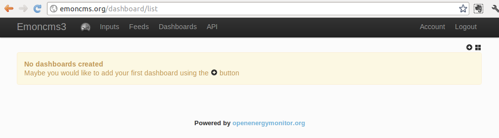

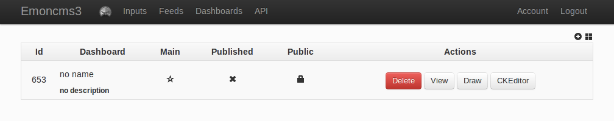

### The draw editor

The Draw editor is a fully visual dashboard editor that work a bit like a normal drawing program in the way its possible to create and resize widgets by clicking and dragging your mouse. To create a dashboard using the draw editor click on the Draw button.

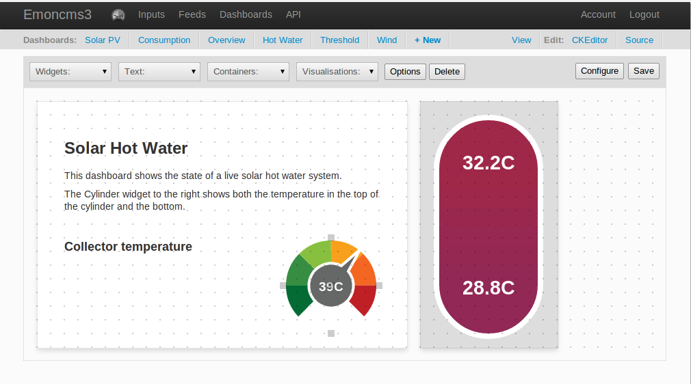

### Containers

With the Draw editor open, a good place to start is to create a container to place a widget in, note that elements are drawn in order of creation so that a dial drawn after a container will appear above the container (at present there is no way to re-order elements).

Click on the _containers_ drop down menu and click on a container type, now click someware in the middle of the drawing area to create a small square container. Next resize the container using the small grey boxes on top, left, right and bottom edge.

Try creating two containers as in the screenshot below, one container to hold a graph and another to hold a dial: 

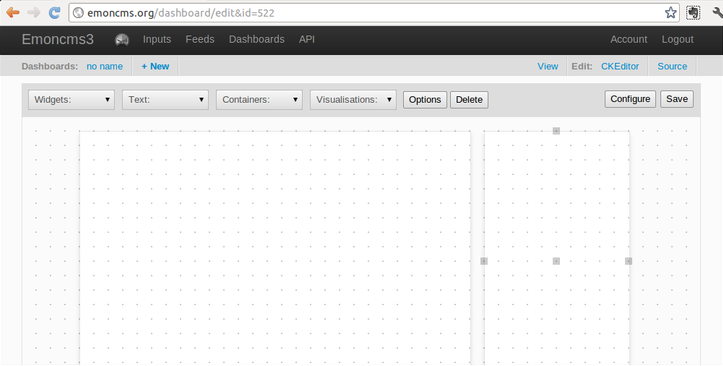

### Dials 

Dials animate in real-time as a feed value changes. The dial changes smoothly from one value to the next. To add a dial click on the _Widgets_ drop down menu and select _Dial_, and then in the same way as creating a container, click in draw draw area. The dial can be moved and resized by clicking and dracking the control points on the edges:

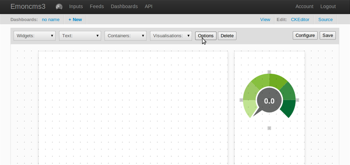

**Dial Options**

To configure the dial click on the options button that appears when the dial is selected, which will bring up a configuration box:

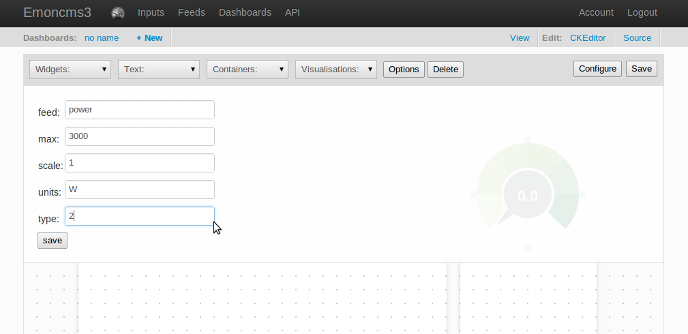

The **feed** that the dial is linked to is specified by giving its name, **max** is the maximum position of the dial. **Scale** can be used for example to multiply a power value by 0.001 to show in kW. **Units**: W, kW, C etc and type is the color style of the dial. There are 9 different color styles available:

0\. Green dial - as above

1\. Red to green

2\. Green to red with the 0 position on the left - as in dial used below.

3\. Green to red with the 0 position in the middle

4\. Red to green with the 0 position on the left

5\. Red to green with the 0 position in the middle

6\. Center green going to orange either side

7\. Electric blue dial

8\. Blue through light red to red (temperature plots)

### Text

Text can be added with the text widgets available from the Text drop down menu. There is a left aligned heading, a centre aligned heading and paragraph text options. Click on one of these and click in the draw area to create the widget, then click on options to set the text:

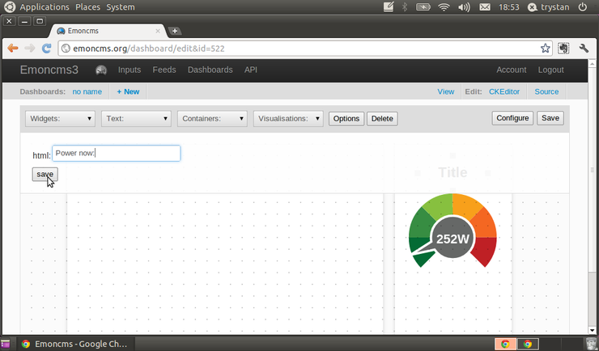

**Note:** The text option can be used to insert any html, such as an image or iframe.

### Visualisations

Most of the visualisations available in emoncms can be added into a dashboard and as with other widgets the visualisations can be moved about and resized as needed. The visualisations are available from the visualisations drop down menu:

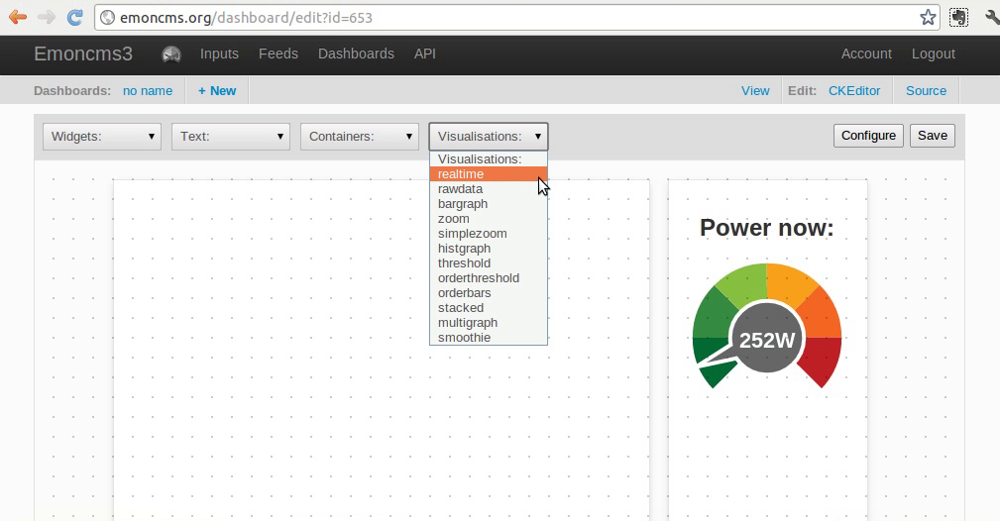

In this example we will add the realtime visualisation. Click on the visualisation youd like to add in the menu and then click in the draw area to create it.

Once created click on the Options button to bring up the visualisation configuration options box:

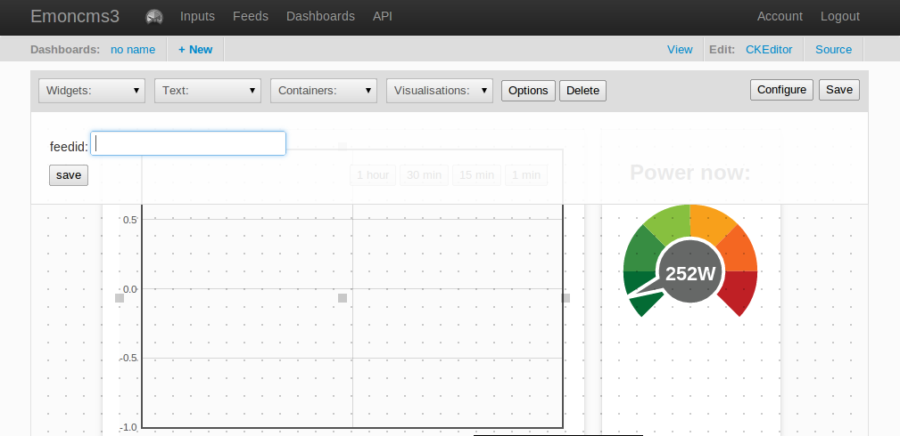

Select from the drop down box the feed you would like to visualise, then click save. The visualisation will now reload with the new settings:

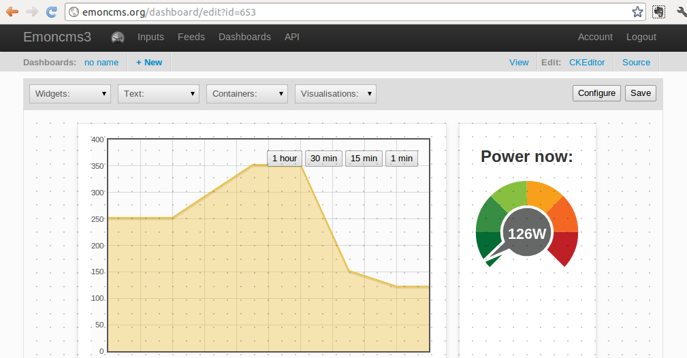

See the section on visualisations below for more information on the available visualisations.

### Dashboard configuration

Each dashboard can have a human readable **name** a menu **alias**, and a **description** and can be a **main** dashboard a **published** dashboard and a **public** dashboard.

A main dashboard is the equivalent to the front page when you'r in run mode. 

A published dashboard is a daschboard that you have finished editing but is not public.

A public dashboard is a dashboard that you choose to share publicly via your username to the web.

These options are set by clicking on the configure button in the editor:

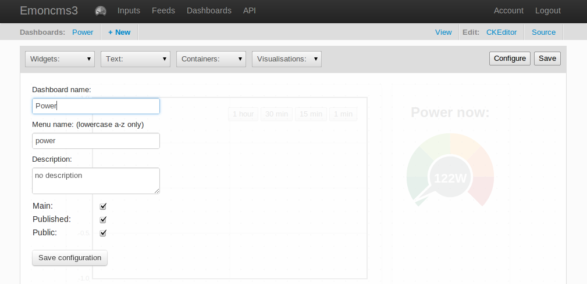

### Dashboard View mode

Click on save to save the dashboard and then view to enter view mode:

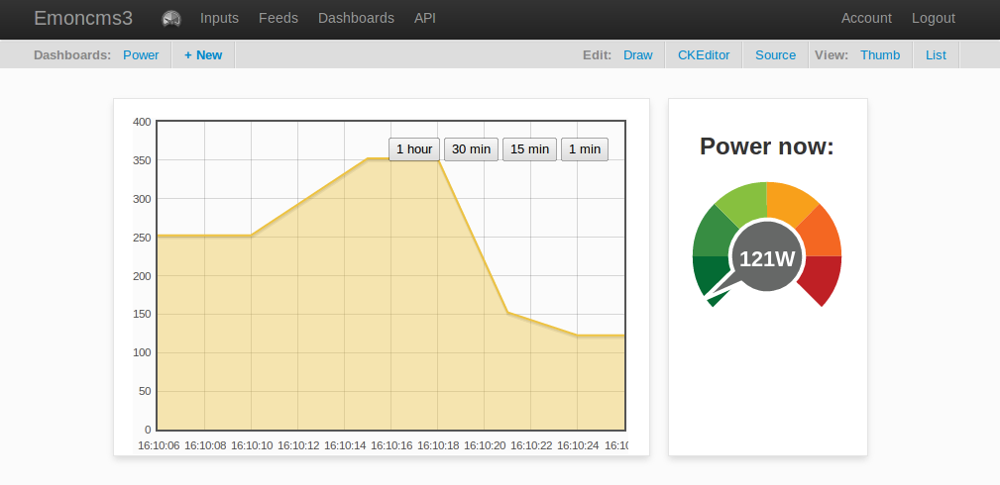

