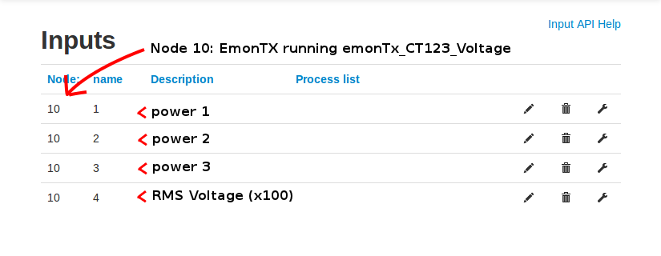

## Identifying emoncms inputs

This page details how to identify emoncms inputs as created by the standard EmonTx firmware configurations.

The monitored data values are sent from the sensor nodes to the basestation in a condensed payload. It is important to keep the payload size as small as possible to save on power especially if the sensor nodes are battery powered, which means no descriptive information is sent about the content of the payload.

At present all the standard data payloads that are sent by the sensor nodes are a series of integer values. Each integer value is two bytes long and its this arrangement that allows for a simple decoding mechanism in emoncms.

For example, in the case of an emontx with the firmware:

### emonTx\_CT123\_Voltage

4 integer data values are sent and the packet is described on line 46:

    typedef struct { int power1, power2, power3, Vrms; } PayloadTX;

This structure creates the following inputs in emoncms, the inputs have been annotated here:

So the first integer (power1) creates an input with node id 10 and input name 1 in emoncms which we know from refering to the emonTx firmware payload structure is the power1 data value.

Below are the rest of the standard firmware payloads for reference:

### emonTx\_CT123

Firmware payload definition line 46:

    typedef struct { int power1, power2, power3, battery; } PayloadTX;

Emoncms inputs:

    node: 10 name: 1 is power1 (Watts)
    node: 10 name: 2 is power2 (Watts)
    node: 10 name: 3 is power3 (Watts)
    node: 10 name: 4 is battery voltage (millivolts)

### emonTx\_temperature\_power

Firmware payload definition line 46:

    typedef struct {int realPower,apparentPower,T1,T2,T3,T4; } Payload;

Emoncms inputs:

Note: temperature inputs need to be divided by 100 to be in degrees C

    node: 10 name: 1 is realPower (Watts)
    node: 10 name: 2 is apparentPower (Watts VA)
    node: 10 name: 3 is T1 (temperature 1 times 100)
    node: 10 name: 4 is T2 (temperature 2 times 100)
    node: 10 name: 5 is T3 (temperature 3 times 100)
    node: 10 name: 6 is T4 (temperature 4 times 100)

### emonTx\_Pulse

Firmware payload definition line 46:

    typedef struct { int power, pulse;} PayloadTX;

Emoncms inputs:

    node: 10 name: 1 is power (in Watts)
    node: 10 name: 2 is pulse (number of pulses detected since last transmittion)

### emontx\_lowpower\_temperature

Firmware payload definition line 46:

    typedef struct { int temp, battery;} PayloadTX;

Emoncms inputs:

    node: 10 name: 1 is temperature (C)
    node: 10 name: 2 is battery voltage (millivolts)
