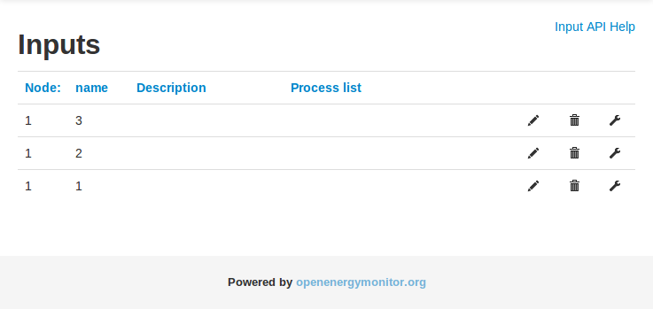
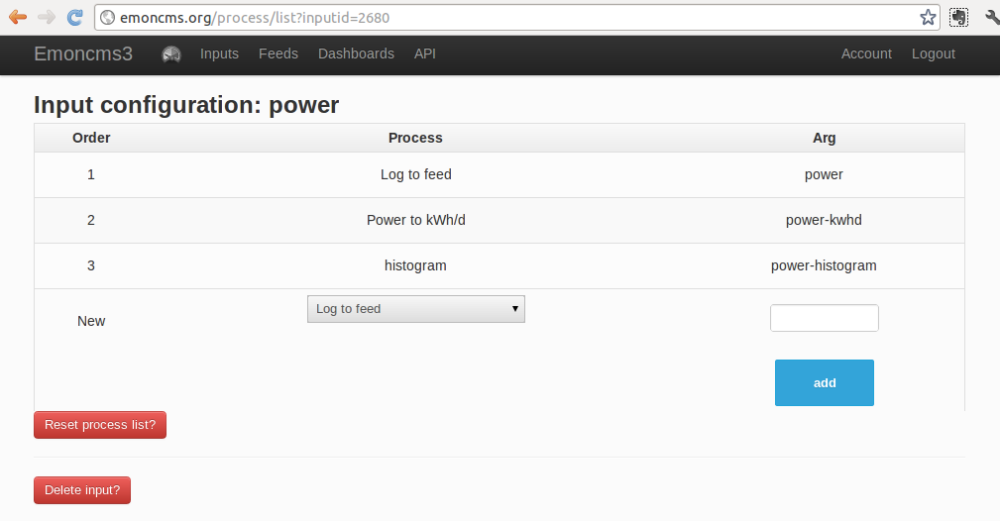
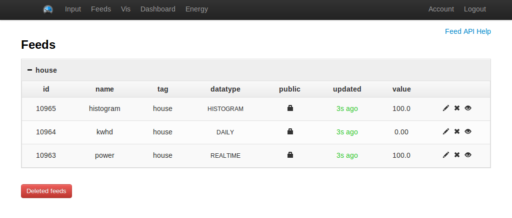

### Sending data to emoncms

Click on the Inputs link in the top bar, this will show a page with a yellow box stating that "no inputs have been created". Click on the **Input API Helper** link in the top right hand corner of the page. 

This page shows all the input API options that exist and is the location of the most up to date input API documentation. Click on the **http://emoncms.org/input/post.json?node=1&csv=100,200,300** example link and select open in new tab to create some example inputs assigned to node id 1\.

Navigate back to the inputs page and you should see three inputs:

If your using standard openenergymonitor emontx firmware have a look at this page on how to identify the inputs: [Identifying inputs](http://emoncms.org/site/docs/identifyinginputs)

At the moment the input page looks quite sparse, you can add a description to make it easier to identify the inputs and once you have added processes as described below a summary of the processes added will appear on the input list page.

### Inputs, feeds and input processing

One of the core features of emoncms is input processing and therefore separation between inputs and feeds.

The need for input processing arose initially from the need to calculate kWh per day data from raw power data. Doing a small bit of processing every time an input is updated means that the kWh/d data can be loaded really fast for visualization rather than having to wait for kwhd data to be calculated on the fly from power data every time you want an overview. As time has moved on however input processing has expanded to allow server based calibration of inputs, multiplying inputs together, histogram data creation and quite a few other things. 

Here's a diagram to illustrate the main concept:

### Manual input configuration

In this example we will configure a power input to log straight to a power feed, add a power to kWh/d processor to create kWh/d data and add a histogram processor to create kWh used at a given power histogram data.

Start by clicking on the input called **node1\_1\.** Create a log to feed input process to log the power input straight to a power feed by clicking on the drop down menu and selecting Log to feed, the argument in the Arg box should be the name you would like to call the resultant power feed, if a feed already exists of the given name it will log to that feed.

Next add a Power to kWh/d input process and a historgram process, arg is in both of these cases the name of the feed you would like to create. The final input processing list should look like this:

Once complete click on Feeds to see the feeds list. When you have monitoring equipment connected you can access quick visualisations of a feed by clicking on the eye icon.

