## Visualisations

The different visualisation options can be explored from the Vis tab in the top menu. These are example screenshots of the different visualisations.

### Realtime

An auto updating realtime line graph of a feed:

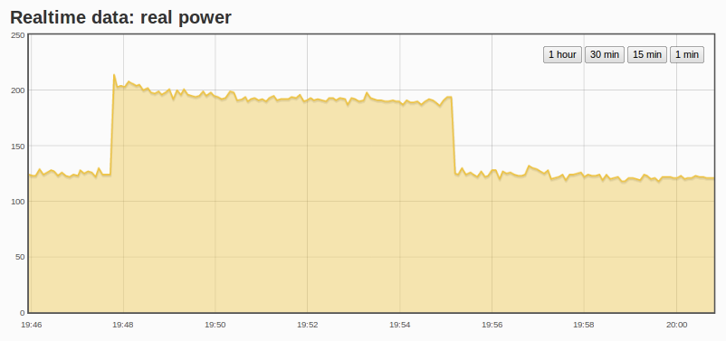

### Rawdata

A zoomable timeseries line graph:

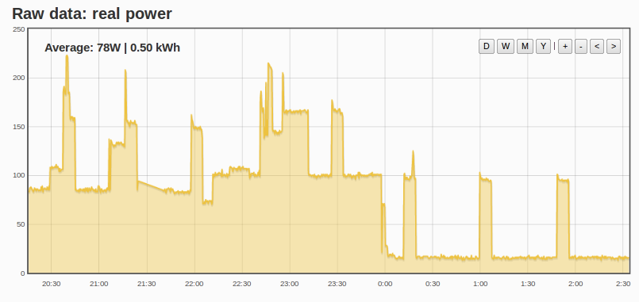

### Bargraph

A simple zoomable bar graph:

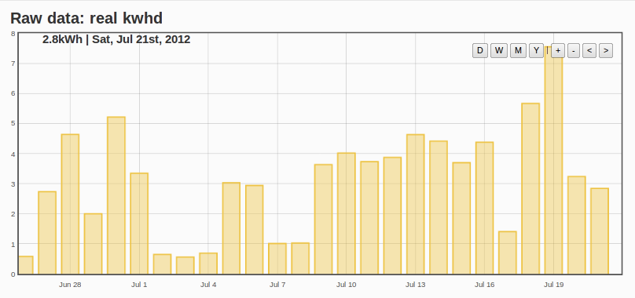

### Smoothie

A nice smooth scrolling realtime updating graph, implementation by Shervin: [http://openenergymonitor.org/emon/node/600][15]

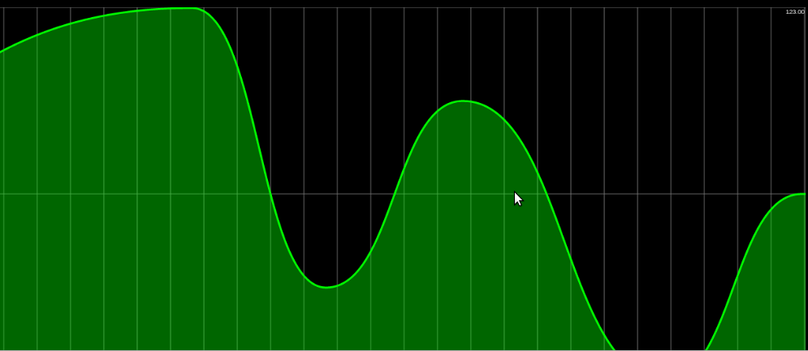

### All time histogram

The all time histogram shows the total amount of energy used at a given power in the total loggin period. So in the example below we can see that the immersion heater has used 170 kWh since about march when logging started.

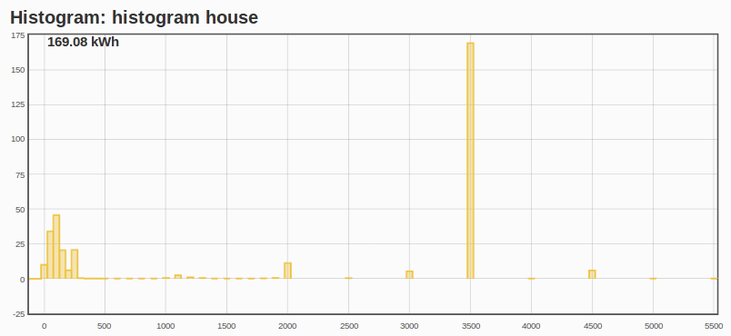

### Daily histogram

As well as being able to zoom from annual kwh/d view to monthly and daily kWh view and then to second by second power view, this visualisation can show the histogram view for a given day: i.e the energy used at a given power level, a useful tool for working out how much a particular appliance used on a given day:

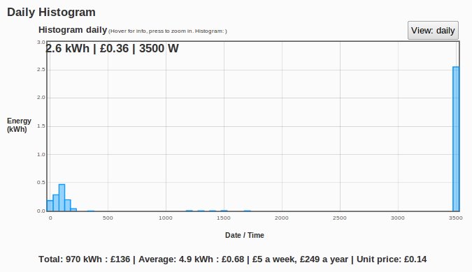

### Zoom

Zoom from annual view -\> monthly view -\> daily view -\> seconds view:

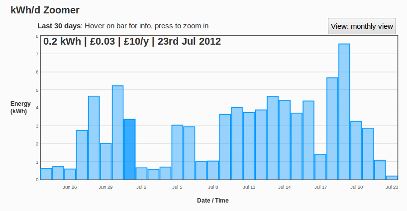

### kWh/d Comparison

Compare different daily energy use from different months, a really nice visualisation by Baptiste Gaultier:

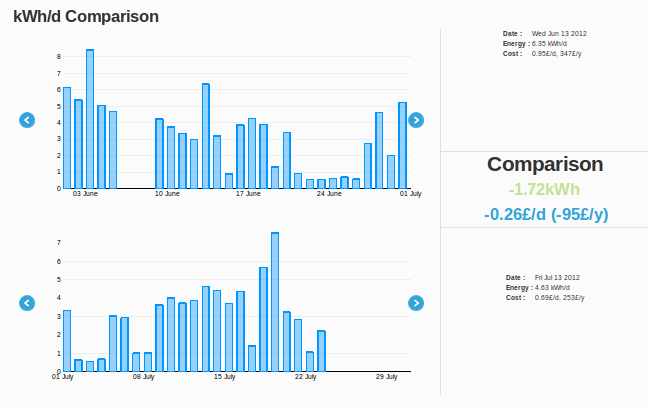

### Stacked

A stacked bar graph, with monthly view:

### Threshold

The threshold visualisation is a useful visualisation enabled by the histogram input processor. Here the different color bars correspond to different power use. Making it possible to see what proportion of a days electricity use is down to low power use say less than 500W, mid power use 500W - 2500W and immersion heater: use above 3500W.

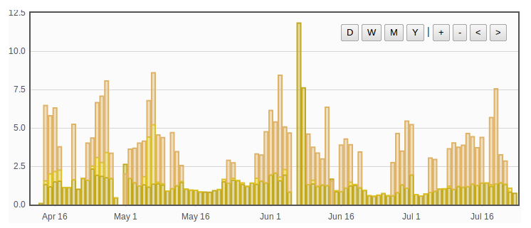

### Simple zoom

Another version of the kWh/d zoomer that zooms from daily view to instantaneous power view and back again, but this version does not have monthly and annual view which simplifies the implementation somewhat.

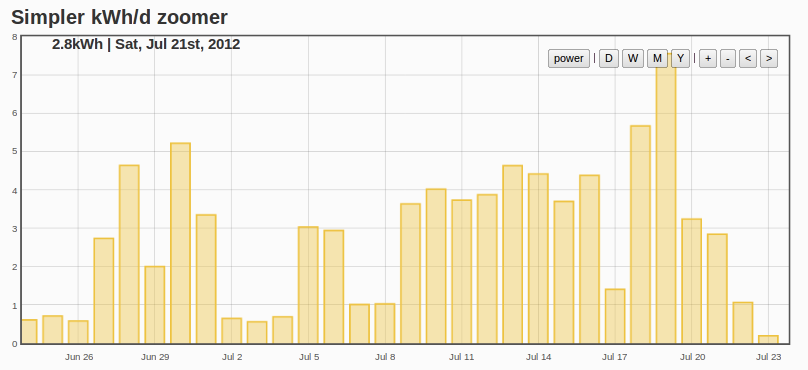

### Bar graph ordered by height

Created for analysing if there is such a thing as a typical days energy use. It takes a the kwd per day data of a particular kwh/d feed such as house consumption and orders it by height. The graph below shows the spread of energy consumption in a house with immersion heated water:

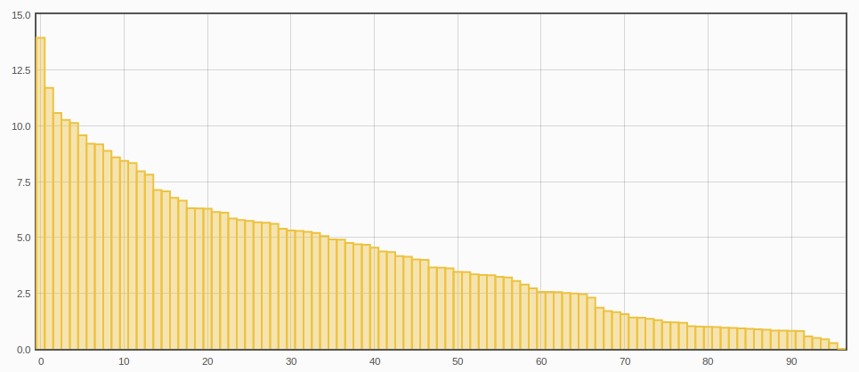

### Threshold ordered by height

Similar to above but using the histogram data, which makes it clearer what level of power use contributes to different total daily energy use values:

### Multigraph
Using the multigraph its possible to assemble multiple different feeds on a single graph for comparison:

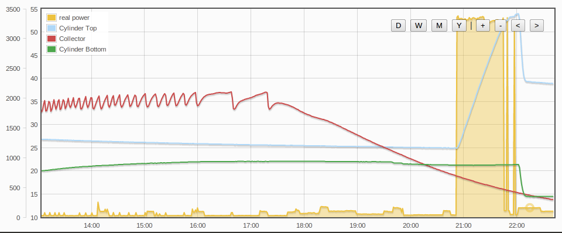

### Datapoint Editor

The datapoint editor is a really useful tool for editing erroneous values in feeds, which can happen if a sensor disconnects or restarts. 

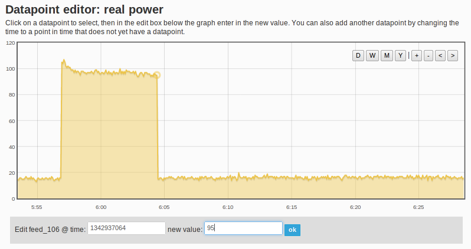

